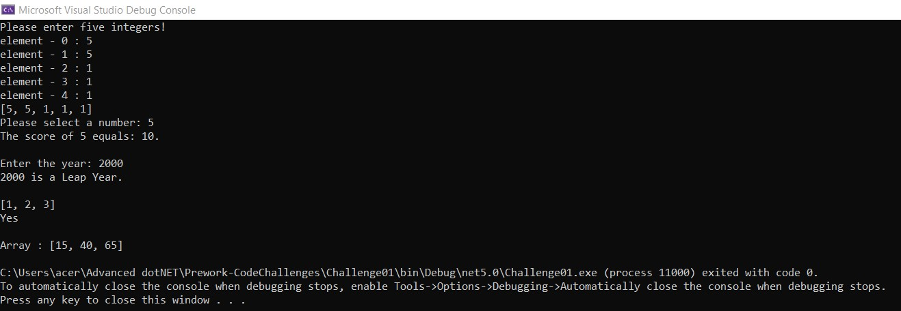

# This is the first challenge.
---
## It was four questions which are:
- Array Max Result: the user inputs an array of integers and a selected integer, the method should return the score of the integre selected. E.g for [2,2,3,5,4] if you pick 2 your score will be 4 (2 2) but if you pick 5 your score will be 5 (5 1).
- Leap Year Calculator: the user input a year number and the method checks if it is a leap year or not.
- Perfect Sequence: the method returns “Yes” if the sequence is considered a perfect sequence. Otherwise, returns “No”.
- Sum of Rows: the method returns the sum of each row in a single dimensional array(already defined).
---
# Output

